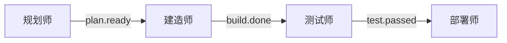
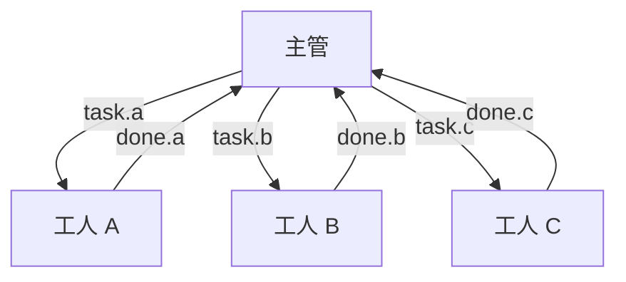
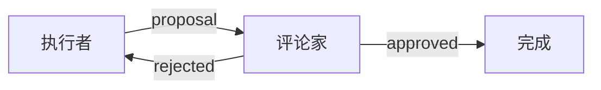

# 换顶帽子换个人：AI 的多重人格

> "一个人可以扮演很多角色，关键是知道什么时候戴什么帽子。"
> —— Ralph 的角色系统设计哲学

## 引言：厨房里的分工

走进任何一家正规餐厅的后厨，你会发现一个有趣的现象：同样是"厨师"，却分成了很多不同的角色。

有人专门负责切菜（配菜师），有人专门负责炒锅（主厨），有人专门负责摆盘（装盘师），还有人专门负责最后的质检（主厨长）。

他们不是同时做所有事情，而是**各司其职、依次接力**。

配菜师切好菜，喊一声"菜好了"，主厨就知道可以下锅了。主厨炒完，喊一声"出锅"，装盘师就接手摆盘。装盘完成，主厨长过目检查，合格才能上桌。

这种分工协作的模式，正是 Ralph 系统中**帽子（Hats）**的灵感来源。

## 什么是"帽子"？

### 一个形象的比喻：戏剧演员

想象一位全能的戏剧演员。

在上午的排练中，他戴上**导演的帽子**——思考整体布局，规划场景转换，调度其他演员。

下午换场时，他戴上**舞美的帽子**——关注灯光、布景、道具的摆放。

晚上演出时，他戴上**演员的帽子**——全身心投入角色，忘掉之前的一切身份。

**同一个人，戴不同的帽子，就变成不同的"人格"。**

在 Ralph 系统中，AI 也是如此。Ralph 本身是一个强大的 AI，但在不同的工作阶段，它会"戴上"不同的帽子，变成具有特定职责和专长的"角色"。

### 帽子的三要素

每顶帽子都由三个核心要素定义：

| 要素 | 作用 | 类比 |
|------|------|------|
| **触发器（Triggers）** | 什么事件激活这个帽子 | 演员听到"开场"就上台 |
| **发布（Publishes）** | 这个帽子能发出什么信号 | 演员可以喊"换场"或"谢幕" |
| **指令（Instructions）** | 这个帽子的行为规则 | 演员的角色剧本 |

让我们看一个具体的例子：

```yaml
hats:
  planner:
    name: "📋 规划师"
    triggers: ["task.start"]        # 当收到"任务开始"信号时激活
    publishes: ["plan.ready"]       # 可以发出"计划就绪"信号
    instructions: |
      分析任务需求，制定实施计划。
      完成后发布 plan.ready 事件。
```

当 Ralph 戴上"规划师"的帽子时，它就会：
- 忘掉其他角色的职责
- 专注于制定计划
- 完成后发出"计划就绪"的信号

## 事件：帽子之间的暗号

### 厨房里的喊单

回到餐厅的比喻。

厨师们是怎么协调工作的？靠**喊单**。

> "三号桌，一份糖醋里脊，走起！"
> "里脊好了，上盘！"
> "三号桌，出菜！"

这些喊声就是厨房里的**事件（Events）**——简短、清晰、包含必要信息。

在 Ralph 系统中，帽子之间也是通过事件来协调的：

```
task.start → 规划师开始工作
    ↓
plan.ready → 建造师接手实现
    ↓
build.done → 审核师验收检查
    ↓
review.approved → 任务完成
```

### 事件的四个组成部分

每个事件都包含：

| 组成部分 | 说明 | 例子 |
|----------|------|------|
| **主题（Topic）** | 事件的类型 | `build.done` |
| **载荷（Payload）** | 附带的简要信息 | `"tests: pass"` |
| **来源（Source）** | 谁发出的 | `builder` |
| **目标（Target）** | 发给谁（可选） | `reviewer` |

关键原则：**事件是路由信号，不是数据传输**。

就像厨房喊单不会把整道菜的做法喊出来一样，事件只传递"发生了什么"，不传递"所有细节"。

```bash
# 好：简洁的事件
ralph emit "build.done" "tests: 42 pass, lint: clean"

# 不好：塞太多信息
ralph emit "build.done" "这是完整的测试报告，第一个测试用例..."
```

## 三种经典的协作模式

在现实世界中，团队协作有很多模式。Ralph 的帽子系统支持多种协作方式，以下是三种最常见的。

### 模式一：流水线（Pipeline）

就像工厂的装配线，每个环节依次处理：

```
规划师 → 建造师 → 测试师 → 部署师
```



**特点**：
- 简单直观
- 每个帽子只关注自己的环节
- 像接力赛一样，棒子传到谁手里谁就跑

**适用场景**：需求明确、流程固定的任务

### 模式二：主管-工人（Supervisor-Worker）

一个主管分配任务给多个工人，然后汇总结果：

```
        ┌→ 工人 A →┐
主管 ─→├→ 工人 B →├→ 主管
        └→ 工人 C →┘
```



**特点**：
- 主管负责分解和整合
- 工人们可以并行工作
- 像项目经理带团队

**适用场景**：大任务需要拆分、多个子任务可以并行

### 模式三：评论家-执行者（Critic-Actor）

一个执行者提出方案，一个评论家审核：

```
执行者 ←→ 评论家
```



**特点**：
- 形成反馈循环
- 持续改进直到满足标准
- 像作家和编辑的关系

**适用场景**：需要迭代优化、质量要求高的任务

## 帽子系统的魔力：专注与分离

### 为什么要分帽子？

你可能会问：AI 那么聪明，为什么不让它同时做所有事情？

想象一下这个场景：

你让一个人同时当厨师、服务员、收银员、清洁工。理论上他可以做到，但实际上：
- 他会手忙脚乱
- 每件事都做不好
- 容易遗漏和出错

**专注带来质量。**

当 Ralph 戴上"规划师"的帽子时，它**只想着规划**——不会分心去想代码怎么写、测试怎么跑。当它戴上"建造师"的帽子时，它**只想着实现**——不会纠结于整体架构。

这就是帽子系统的魔力：**通过强制分离职责，让每个阶段都能获得最专注的处理**。

### 交响乐团的比喻

把帽子系统想象成交响乐团。

指挥（事件系统）挥动指挥棒，小提琴组（规划师帽子）开始演奏第一乐章。当他们的部分结束时，指挥一挥手，大提琴组（建造师帽子）接上。接着是管乐组（测试师帽子），最后是打击乐组（部署师帽子）。

每个声部都专注于自己的乐谱，通过指挥的协调，共同完成一部宏大的交响曲。

没有人会让小提琴手同时敲定音鼓——那样只会乱套。

## 配置你自己的帽子

### 基础配置

```yaml
hats:
  builder:
    name: "🔨 建造师"
    triggers: ["task.start", "plan.ready"]
    publishes: ["build.done", "build.failed"]
    instructions: |
      实现任务或计划中的功能。
      完成后运行测试确认。
```

### 高级配置

```yaml
hats:
  reviewer:
    name: "🔍 审核师"
    triggers: ["build.done"]
    publishes: ["review.approved", "review.rejected"]
    backend: "claude"        # 可以指定使用哪个 AI 后端
    max_activations: 3       # 最多激活 3 次（防止无限循环）
    instructions: |
      审核实现的质量。
      检查测试覆盖率和代码风格。
```

### 触发器的匹配模式

触发器支持灵活的匹配：

```yaml
# 精确匹配
triggers: ["task.start"]        # 只匹配 task.start

# 通配符匹配
triggers: ["build.*"]           # 匹配 build.done, build.failed 等
triggers: ["*.error"]           # 匹配 build.error, test.error 等
triggers: ["*"]                 # 匹配所有事件（谨慎使用！）
```

就像餐厅里的分工：
- 主厨只响应"开炒"的喊单
- 传菜员响应任何"出菜"的喊单
- 主厨长响应所有跟"质量"相关的喊单

## 一个完整的例子：代码审查工作流

让我们看一个真实的例子，理解帽子如何协同工作。

**场景**：实现一个新功能，需要规划、编码、测试、审查四个步骤。

```yaml
hats:
  planner:
    name: "📋 规划师"
    triggers: ["task.start"]
    publishes: ["plan.ready", "plan.blocked"]
    instructions: |
      分析任务需求，制定实施计划。
      如果需求不清晰，发布 plan.blocked。
      计划完成后，发布 plan.ready。

  builder:
    name: "🔨 建造师"
    triggers: ["plan.ready"]
    publishes: ["build.done", "build.failed"]
    instructions: |
      根据计划实现功能。
      运行测试确保代码正确。
      完成后发布 build.done，附带测试结果。

  tester:
    name: "🧪 测试师"
    triggers: ["build.done"]
    publishes: ["test.passed", "test.failed"]
    instructions: |
      运行完整的测试套件。
      检查代码覆盖率。
      测试通过后发布 test.passed。

  reviewer:
    name: "🔍 审核师"
    triggers: ["test.passed"]
    publishes: ["review.approved", "review.rejected"]
    instructions: |
      审核代码质量和可读性。
      检查是否符合项目规范。
      通过则发布 review.approved。
```

**执行流程**：

```
用户：实现用户登录功能

task.start → 规划师激活
    ↓
规划师：分析需求，制定计划
    ↓
plan.ready → 建造师激活
    ↓
建造师：编写代码，运行测试
    ↓
build.done → 测试师激活
    ↓
测试师：运行完整测试套件
    ↓
test.passed → 审核师激活
    ↓
审核师：审查代码质量
    ↓
review.approved → 任务完成！
```

**如果中间某步失败**：

```
test.failed → 建造师重新激活（修复问题）
    ↓
build.done → 测试师再次验证
    ...
```

这就是帽子系统的自我修复能力——失败不会中断流程，而是触发重试。

## 最佳实践

### 1. 每顶帽子一个职责

```yaml
# 好：职责单一
hats:
  tester:
    instructions: "运行测试，报告结果。"

# 不好：职责混乱
hats:
  everything:
    instructions: "测试、部署、写文档、发通知..."
```

就像餐厅不会让洗碗工同时负责采购、烹饪、收银一样。

### 2. 触发器要明确

```yaml
# 好：明确的触发条件
triggers: ["plan.ready", "plan.revised"]

# 危险：太宽泛
triggers: ["*"]  # 任何事件都会激活——容易混乱！
```

### 3. 事件保持简洁

```bash
# 好：简洁的信号
ralph emit "build.done" "tests: pass, lint: clean"

# 不好：塞入太多信息
ralph emit "build.done" "完整的测试日志输出..."
```

### 4. 设置激活上限

```yaml
# 防止无限循环
hats:
  refactorer:
    max_activations: 3  # 最多重构 3 次
```

## 小结

**帽子系统**是 Ralph 实现 AI 分工协作的核心机制。

核心概念：
- **帽子** = AI 的人格面具，每顶帽子有特定职责
- **事件** = 帽子之间的协调信号
- **触发器** = 决定什么时候"戴上"这顶帽子

三种协作模式：
1. **流水线**：依次接力，像工厂装配线
2. **主管-工人**：分解并行，像项目团队
3. **评论家-执行者**：迭代改进，像作家与编辑

设计原则：
- 每顶帽子一个职责
- 事件简洁明了
- 触发器精确匹配

帽子系统的本质是**专注的力量**——通过让 AI 在不同阶段扮演不同角色，确保每个阶段都能获得最专业的处理。

就像一个优秀的演员，不是同时扮演所有角色，而是在每个场景中全身心投入当前的角色。换一顶帽子，就是换一个人。

---

*上一篇：[质量门卫：用"反压"代替"处方"](04-backpressure.md)*

*下一篇：[事件的舞蹈：AI 如何协调工作](06-events-system.md)*
