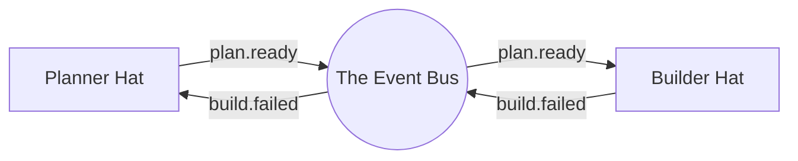

# Article 06: The Nervous System (Events & Routing)

> *In the Ralph ecosystem, if the "Loop" is the heartbeat and "Hats" are the organs, then **Events** are the nervous system that connects them all.*

Imagine your body for a moment. When you touch a hot stove, your finger doesn't write a detailed report about the temperature, chemical composition of the burner, and the duration of contact, then mail it to your brain.

No. It sends a sharp, instant signal: **PAIN!**

Your brain receives this signal and immediately routes a command to your muscles: **PULL BACK!**

This is exactly how **Events** work in Ralph. They are the synapses firing across the system—fast, lightweight, and purpose-built to trigger action.

## The Signal, Not the Cargo

A common mistake in building agentic systems is trying to stuff the entire state of the world into the message passing system. That's like trying to send a library of books through a telegraph wire.

In Ralph, we follow a strict biological rule: **Events are routing signals, not data carriers.**

### The Anatomy of an Event

An event in Ralph is tiny. It usually looks like this:

*   **Topic**: `task.completed` (The signal type)
*   **Payload**: `id: 123` (The minimum context needed)

That's it. It doesn't contain the code that was written, the test logs, or the entire file history. That heavy "cargo" lives in the **Memory** (the brain) or on the **File System** (the environment). The event just says, *"Hey! Look over here! usage of `task.completed` happened!"*

## The Synapse: From Hat to Hat

In our previous article, we talked about **Hats** (the specialist roles). But a specialist sitting in a room alone isn't an organization; it's just a lonely expert. They need to talk.

Events are the language they speak.



### Declarative Reflexes

How does the system know who listens to what? In biology, neural pathways are established over time. In Ralph, we define them in `ralph.yml`. This is what we call **Declarative Routing**.

You explicitly tell each Hat what signals to listen for (`triggers`) and what signals it can fire (`publishes`).

```yaml
# The "Nervous System" Map
hats:
  architect:
    # The brain listens for problems
    triggers:
      - "build.failed"
      - "task.blocked"

  builder:
    # The muscle waits for orders
    triggers:
      - "plan.ready"
    publishes:
      - "build.done"
      - "build.failed"
```

This configuration creates a predictable "reflex arc." If the `build.failed` signal fires, the **Architect** Hat immediately "wakes up" to analyze the error. The Builder doesn't need to know who the Architect is; it just cries out in pain (`build.failed`), and the system ensures the right specialist responds.

## Why "Lightweight" Matters

Why are we so obsessed with small events?

1.  **Speed**: Checking a string like `review.done` is instantaneous. Parsing a 5MB JSON object of context is not.
2.  **Decoupling**: If the Planner sends a huge object of data to the Builder, the Builder becomes dependent on that data structure. If the data format changes, the Builder breaks. By sending only a signal (`plan.ready`), the Builder knows to go look at the standard Plan file (the "shared memory") for details.
3.  **Clarity**: You can trace the logic of your agent by just reading the event log. It reads like a story: `plan.ready` -> `code.written` -> `test.failed` -> `plan.revised`.

## Summary

Events are the spark of life in the Ralph Orchestrator. They turn a collection of static tools and prompts into a dynamic, reactive organism.

*   **Events are Synapses:** They connect the organs (Hats).
*   **Signals, not Cargo:** They carry intent, not heavy data.
*   **Declarative wiring:** `triggers` and `publishes` map the neural pathways.

Now that we have a body (Hats) and a nervous system (Events), we need something to keep the blood pumping. Next, we'll look at the **Loop**—the heartbeat that drives it all.
