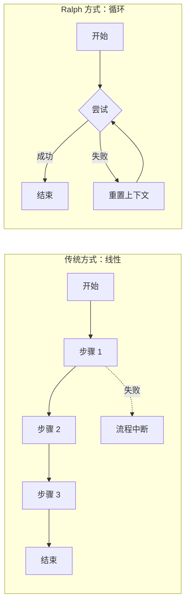

# 永不放弃的机器人：Ralph 循环技术

> "Me fail English? That's unpossible!"（我英语不及格？那是不可能的！）
> —— Ralph Wiggum，《辛普森一家》

## 引言：一个永不言败的小机器人

学骑自行车的过程里，第一次摔倒，第二次摔倒，第三次、第四次……但那个孩子有点特别——他从不气馁，每次摔倒后都若无其事地爬起来，重新开始。更神奇的是，他摒弃了上一次摔倒的恐惧或错误习惯，以全新的状态再次尝试。

终于，在第 N 次尝试后，他成功了。

这就是 **Ralph Wiggum Technique**（Ralph 循环技术）的核心思想——一种让 AI 自主完成任务的革命性方法。

## 什么是 Ralph 循环技术？

### 最简形式：一个 Bash 循环

Ralph 循环技术的发明者 Geoffrey Huntley 用一句话概括了它的本质：

> "Ralph is a Bash loop."（Ralph 就是一个 Bash 循环。）

用代码表示，它简单到令人难以置信：

```bash
while :; do cat PROMPT.md | claude ; done
```

翻译过来就是：**不断重复执行同一个任务，直到成功为止。**

这像是一个永不疲倦的员工，收到任务后就开始工作，失败了就从头再来，成功了才停下。

### 为什么简单的东西会有效？

这种方法确实简单粗暴。但正是这种简单，赋予了它强大的力量。Huntley 把这种方法描述为"在不确定的世界中确定性地失败"——它失败的方式是可预测的，因此也是可修复的。

我们可以用一个比喻来解释：

**传统方法如同指挥交响乐团**——你需要精确地告诉每个乐手何时演奏什么音符，稍有差错整首曲子就毁了。

**Ralph 方法如同调吉他**——你只需要知道正确的音高是什么，然后不断调整琴弦，听起来对了就停。过程可能需要多转几次旋钮，但最终一定能调准。

## 核心理念：定义终点，莫问路径

传统的 AI 工作流程通常是这样的：

```
人类：做第一步
AI：好的，完成了
人类：现在做第二步
AI：好的，完成了
人类：现在做第三步……
```

这如同教别人做菜时，一步一步地盯着他：先切葱、再热油、然后……

而 Ralph 循环技术颠覆了这个模式：

```
人类：这是成功的样子。做到为止。
AI：[自己反复尝试，直到成功]
```

你告诉厨师："给我做一道红烧肉，要入口即化、肥而不腻。" 然后你就可以去处理其他事务了。厨师会自己想办法，做不好就重做，直到达到你的标准。



## 为什么每次都要"从头开始"？

Ralph 循环技术有一个反直觉但极其重要的特性：**每次迭代都从新鲜的上下文开始。**

做一道数学题时，如果第一次做错了，我们往往会带着错误的假设继续尝试，结果越错越远。但如果能像金鱼一样"失忆"，每次都重新审视题目，反而可能更快找到正确答案。

对于 AI 来说也是如此：

- **不会积累困惑**：上一次的错误思路不会污染这一次的判断
- **每次都是新机会**：如同考试时重新读一遍题目，可能会发现之前忽略的信息
- **避免"钻牛角尖"**：不会因为之前的失败而陷入思维定势

这就是 Ralph 能在很多复杂任务上表现出色的原因——它不会被自己的历史包袱拖累。

## 现实世界的成功案例

Ralph 循环技术已经在真实项目中证明了自己的价值：

| 案例 | 成果 |
|------|------|
| **Y Combinator 黑客马拉松** | 一个团队在一夜之间用 Ralph 循环完成了 6 个代码仓库的开发 |
| **商业合同项目** | 一位工程师用仅 297 美元的 API 成本完成了价值 50,000 美元的合同 |
| **编程语言开发** | Huntley 本人通过 3 个月的 Ralph 循环，创造了一门完整的编程语言（CURSED） |

## 什么任务适合用 Ralph？

### ✅ Ralph 擅长的领域

- **大规模重构和迁移**：比如把整个项目从 JavaScript 迁移到 TypeScript
- **批量操作**：比如为所有函数添加文档注释
- **新项目搭建**：从零开始构建项目脚手架
- **有明确完成标准的任务**：比如"所有测试必须通过"

### ❌ Ralph 不太适合的场景

- **需求模糊的任务**：如果你自己都不知道想要什么，Ralph 也帮不了你
- **需要人类判断的工作**：比如决定产品设计方向
- **安全敏感的代码**：涉及密码、密钥等敏感信息的操作
- **探索性工作**：比如调研一个新技术的可行性

## 哲学启示：置身循环之上

Ralph 循环技术的创始人有一句名言：

> "Let Ralph Ralph."（让 Ralph 去 Ralph。）

这句话的意思是：你的工作是设置好约束条件和成功标准，然后放手让 AI 去工作。与其一步步指挥，不如让 AI 自行寻找路径。

这如同放风筝——你调整线的松紧和角度，任由风筝自己寻找平衡，不必试图控制它的每一个动作。风筝会自己找到平衡，你只需要确保它不会飞走或坠落。

## 小结

Ralph 循环技术的核心可以用三句话概括：

1. **定义成功**：告诉 AI 什么样的结果是可接受的
2. **放手让它干**：不要一步一步地指挥，让 AI 自己想办法
3. **持续迭代**：失败了就重来，直到成功

定义好目标并信任过程，无需试图预测和控制每一个步骤。

在接下来的文章中，我们将深入探讨 Ralph 循环技术的其他核心概念，包括"新鲜上下文"的力量、如何用文件作为 AI 的记忆、以及质量门控（Backpressure）的重要性。

---

*下一篇：[每次都是新开始：AI 的"金鱼记忆"优势](02-fresh-context.md)*
