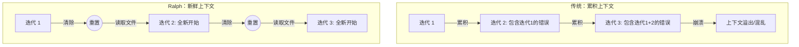

# 每次都是新开始：AI 的"金鱼记忆"优势

> "新鲜的上下文就是可靠性。"
> —— Ralph 六大信条之首

## 引言：金鱼的智慧

关于金鱼，有一个流传甚广的说法——据说金鱼的记忆只有七秒，每绕鱼缸一圈，眼前的世界就是全新的。

虽然这个说法并不科学（金鱼的记忆实际上可以持续好几个月），但它揭示了一个有趣的思维实验：**若能每次以全新视角审视问题，结果将截然不同。**

在 Ralph 循环技术中，这不仅是趣谈，更是一个核心设计原则——**Fresh Context（新鲜上下文）**。

## 什么是"新鲜上下文"？

### 每次迭代都从零开始

以侦探查案为例。

**传统方式**如同你一直盯着同一块白板，上面贴满了线索、照片、红线和便利贴。随着时间推移，白板越来越乱，某些早期的错误假设可能已经深深嵌入你的思维中，但你已经看不出它们有什么问题了——因为你"习惯了"。

**新鲜上下文方式**则完全不同。每天早上，你走进办公室，面对的是一块**干净的白板**。所有的证据都整齐地放在档案柜里（磁盘上的文件），你需要重新阅读它们，重新分析，重新建立联系。

听起来效率低下？

这种"失忆"反而成为了一种超能力。

## 为什么"遗忘"反而更好？

### 1. 不会积累困惑

在调试复杂 bug 的真实场景中，我们经常遇到这种情况。

第一次尝试时，你怀疑是数据库连接的问题，花了两小时证明这条路走不通。第二次，你认为是缓存导致的，又花了一小时排除。第三次……

此时，你的脑子里已经塞满了各种"这个不行"、"那个试过了"的记忆。这些记忆不仅占用你的"内存"，还可能形成**思维定势**——思维定势会让你避开某些方向，只因它们酷似之前的失败路径。

而 AI 使用新鲜上下文时，每次迭代都会：

- 重新阅读任务描述
- 重新审视代码
- 重新做出判断

那些曾经的"死路"，它根本不记得。这意味着如果第一次判断错误地排除了正确答案，第二次迭代完全可能重新发现它。

### 2. 每次都是新机会

这如同考试时重新读一遍题目。

有多少次，你在考试时被一道题卡住，绞尽脑汁也想不出答案。但当你放弃、跳过几道题后回来重新审视，却突然发现："哦，原来这么简单！"

**重新阅读 = 重新理解。**

AI 在每次迭代开始时都会重新阅读提示词（PROMPT.md）、检查代码状态、分析测试结果。这个过程如同每次考试都重新读一遍题目——你可能会注意到之前忽略的关键细节。

### 3. 避免"钻牛角尖"

心理学上有个概念叫**功能固着（Functional Fixedness）**——当你习惯用某种方式看待事物后，就很难用新的方式去理解它。

经典案例是"蜡烛问题"：给你一根蜡烛、一盒图钉、一盒火柴，要求你把蜡烛固定在墙上并点燃，同时不能让蜡油滴到地上。

很多人会执着于把图钉穿过蜡烛钉到墙上，而忽略了一个简单的解决方案：**把装图钉的盒子当作托盘，用图钉把盒子钉在墙上，再把蜡烛放在盒子里。**

为什么这么简单的答案会被忽略？因为我们的大脑习惯性地把"装图钉的盒子"视为"装东西的容器"，却忽略了它也是"可以利用的工具"。

新鲜上下文打破了这种固着。AI 不会记得自己之前把盒子当成什么，每次都会重新评估所有可能性。

## 新鲜上下文的科学原理

### "智能区"理论

Ralph 的设计者们发现，AI 模型有一个**"智能区"（Smart Zone）**——大约在其上下文窗口的 40%-60% 使用率时表现最佳。

**太少的上下文**：AI 缺乏足够的信息做出正确判断。
**太多的上下文**：AI 开始"迷失"在信息海洋中，关键信息被噪音淹没。

这如同你的书桌：

- 太空旷（只有一张白纸）：你缺乏参考资料
- 太杂乱（堆满了书籍、便条、咖啡杯）：你找不到需要的东西

新鲜上下文确保每次迭代都从**恰到好处**的信息量开始。

### Token 经济学

AI 的上下文窗口是有限的。以 Claude 为例，它有大约 200,000 个 token（可以理解为词语的碎片）的容量。

如果不清理上下文，每次对话都会累积更多的历史记录，最终：

```
第 1 次迭代：任务描述（10%）+ 代码（20%）= 30% 使用率
第 5 次迭代：任务描述（10%）+ 代码（20%）+ 历史对话（40%）= 70% 使用率
第 10 次迭代：任务描述（10%）+ 代码（20%）+ 历史对话（80%）= 💥 溢出！
```

新鲜上下文通过每次"清零"历史对话，确保 AI 始终有足够的"思考空间"。

## 那记忆呢？完全不要吗？

当然要。

这就引出了 Ralph 的另一个核心设计：**磁盘即状态（Disk Is State）**。

虽然 AI 的对话记忆会被清除，但所有重要的信息都保存在**文件**中：

| 信息类型 | 存储位置           | 作用             |
| -------- | ------------------ | ---------------- |
| 任务描述 | PROMPT.md          | 告诉 AI 要做什么 |
| 代码     | 项目文件           | AI 工作的对象    |
| 学习成果 | .agent/memories.md | 跨会话的知识积累 |
| 工作进度 | .agent/tasks.jsonl | 追踪什么已完成   |
| 版本历史 | Git                | 完整的变更记录   |

每次迭代开始时，AI 会重新读取这些文件。如同那个侦探每天早上面对干净的白板，但档案柜里保存着所有的证据——他会重新研读档案，而非依赖可能存在偏差的记忆。

**对话记忆清除，磁盘记忆保留。**

这是一个精妙的平衡：

- 清除容易产生偏见的短期记忆
- 保留经过验证的长期知识

## 一个比喻：装修你的房间

就像装修房间一样。

**传统方式（保留上下文）**：

1. 你买了一张红色沙发，摆在客厅中央
2. 然后买了一块蓝色地毯，铺在沙发下面
3. 接着买了黄色窗帘……
4. 每一个决定都基于之前的选择
5. 最后发现：红配蓝配黄，简直是灾难！
6. 但你已经投入太多，不想推翻重来

**新鲜上下文方式**：

1. 第一次尝试：全部搭配好，拍照，记录
2. 如果效果不好，清空房间
3. 第二次尝试：面对空房间，重新思考搭配
4. 这次你可能会发现：其实应该从窗帘开始选起
5. 不再受制于之前的红沙发。

每次迭代都如同面对一个空房间——你可以完全重新规划，不受过去错误决定的束缚。



## 实践中的效果

这种"金鱼式"设计在实践中表现如何呢？

### 案例：修复一个顽固的 Bug

传统方法：

```
迭代 1：怀疑是 A 问题，修改 A，测试失败
迭代 2：基于"A 不是问题"的假设，怀疑 B，修改 B，测试失败
迭代 3：基于"A 和 B 都不是问题"的假设，怀疑 C，修改 C，测试失败
...
迭代 10：思维已经被前 9 次的假设完全束缚
```

新鲜上下文方法：

```
迭代 1：分析代码，怀疑是 A 问题，修改 A，测试失败
迭代 2：（重新分析）这次注意到了一个之前忽略的细节，怀疑是 D 问题
迭代 3：修复 D，测试通过！
```

在迭代 2 中，由于没有"A 不是问题"这个包袱，AI 能够以全新的眼光审视代码，发现真正的问题所在。

## 给人类的启示

新鲜上下文不仅仅是 AI 设计原则，它也给我们人类一些启示：

### 1. 定期"重启"你的思维

遇到难题时，不要一直钻研。站起来走走，喝杯咖啡，第二天再回来看。你会惊讶地发现，很多之前看不清的东西突然变得清晰了。

### 2. 记录胜过记忆

把重要的想法写在纸上或电脑里，而不是试图用大脑记住一切。这样你就可以"安全地遗忘"，随时以新鲜的视角重新审视这些想法。

### 3. 拥抱"初学者心态"

禅宗有个概念叫"初心"（Beginner's Mind）——即使你是专家，也要像初学者一样看待问题。新鲜上下文本质上就是在技术层面实现"初心"。

## 小结

**新鲜上下文**是 Ralph 六大信条之首，它告诉我们：

1. **遗忘是一种超能力**：不被过去的错误假设束缚
2. **每次迭代都是新机会**：可能发现之前忽略的信息
3. **磁盘保存记忆**：重要的知识存储在文件中，不依赖 AI 的对话记忆
4. **保持在"智能区"**：确保 AI 有足够的思考空间

尽管常识教导我们要"吃一堑长一智"，但在 AI 自主工作的场景中，战略性的"失忆"往往是通往成功的捷径。

---

*上一篇：[永不放弃的机器人：Ralph 循环技术](01-ralph-wiggum-technique.md)*

*下一篇：[六条黄金法则：Ralph 的设计哲学](03-six-tenets.md)*
