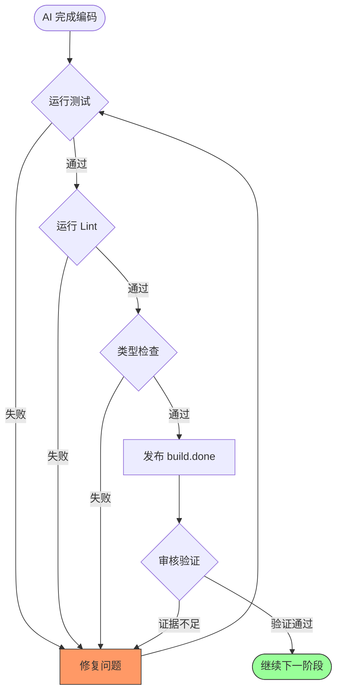

# 质量门卫：用"反压"代替"处方"

> "不要规定'怎么做'；创建拒绝劣质工作的质量门禁。"
> —— Ralph 第二信条

## 引言：两种管理方式

作为一家软件公司的技术主管，当你需要让一位新人实现"用户邮箱验证"功能时。

你会怎么指导他？

**方式 A：开药方**

```
第一步：创建 validator.js 文件
第二步：写一个 validateEmail 函数
第三步：使用正则表达式 /^[a-zA-Z0-9...
第四步：如果匹配成功返回 true
第五步：为函数添加 JSDoc 注释
第六步：创建测试文件 validator.test.js
第七步：写三个测试用例...
```

**方式 B：设门禁**

```
实现邮箱验证功能。

验收标准：
- 测试通过
- 代码检查通过
- 类型检查通过
```

你觉得哪种方式更好？

如果你选择了方式 B，恭喜你——你已经理解了 Ralph 的核心设计理念之一：**反压（Backpressure）**。

## 什么是"反压"？

### 一个直观的比喻：机场安检

观察一下机场安检的流程。

安检员并不会指示：
> "请先把外套脱下来，叠好放在第三个托盘里。然后把笔记本电脑从包里取出来，单独放一个托盘。接着把液体物品装进透明袋子..."

安检员仅设置一道**门禁**：
> "所有物品过 X 光机，不合格不能通过。"

至于你怎么收拾行李、用几个托盘、先放什么后放什么——那是你的事。你可以用任何方法，只要最终能通过安检就行。

这就是**反压**的本质：

- **不规定过程**（怎么整理行李）
- **只设定标准**（能通过 X 光检查）
- **不合格就打回去**（不能登机）

### 为什么叫"反压"？

这个术语来自流体力学和系统工程。

以水管为例。如果下游堵住了，水就会"反压"回来，阻止上游继续放水。这是一种自然的流量控制机制——不需要人工干预，系统自己就能调节。

在软件工程中，反压指的是：**下游系统通过拒绝不合格的输入，迫使上游系统提高质量**。

用在 Ralph 中：
- **上游** = AI 写的代码
- **下游** = 质量门禁（测试、代码检查、类型检查）
- **反压** = 门禁拒绝不合格的代码，AI 必须修改后重试

## 反压 vs 处方：核心区别

让我们深入对比这两种方法。

### 处方式管理

```
传统方法（像医生开药方）：

1. 首先，写这个函数
2. 然后，写这些测试
3. 接着，运行测试
4. 如果失败，修复这里
5. 然后，运行代码检查
...
```

**问题：**

1. **脆弱**：如果情况变化了怎么办？如果第 3 步失败但原因不在第 4 步提到的地方怎么办？
2. **低效**：AI 必须按部就班，即使它知道更好的方法
3. **难以验证**：你怎么确认 AI "正确地"遵循了每一步？

### 反压式管理

```
Ralph 方法（像设置门禁）：

实现这个功能。
证据要求：tests: pass, lint: pass, typecheck: pass
```

**优势：**

1. **灵活**：AI 可以用任何方法达成目标
2. **高效**：AI 可以发挥自己的"聪明才智"
3. **可验证**：测试通过就是通过，不通过就是不通过——没有模糊地带

### 一张对比表

| 维度 | 处方式 | 反压式 |
|------|--------|--------|
| 告诉 AI | 怎么做（How） | 什么是好的（What） |
| 灵活性 | 低（必须按步骤） | 高（自由选择方法） |
| 可验证性 | 低（难以检查是否遵循） | 高（通过/不通过很清晰） |
| 适应变化 | 差（步骤可能失效） | 好（标准始终有效） |
| 发挥 AI 能力 | 限制 | 充分利用 |

## 反压的三道门禁

在 Ralph 系统中，反压通过三种类型的"门禁"来实现。

### 1. 技术门禁：代码的"体检报告"

就像人要定期体检一样，代码也需要"体检"。技术门禁是一系列自动化检查：

| 门禁 | 检查什么 | 比喻 |
|------|----------|------|
| **测试** | 功能是否正确 | 心电图——核心功能正常吗？ |
| **Lint** | 代码风格是否规范 | 外观检查——穿着得体吗？ |
| **类型检查** | 数据类型是否正确 | 血型检验——类型匹配吗？ |
| **格式检查** | 代码格式是否统一 | 仪容仪表——整洁吗？ |
| **构建** | 能否成功编译 | 体能测试——能正常工作吗？ |

这些门禁的特点是：**完全客观、自动执行、不需要人工判断**。

```bash
# Ralph 中的典型反压要求
cargo test && cargo clippy && cargo fmt --check
# 全部通过才能继续
```

### 2. 行为门禁：AI 审核 AI

有些质量标准不是非黑即白的，比如：
- 代码可读性好不好？
- 变量命名有没有意义？
- 复杂度是否合理？

这时候，Ralph 采用**让 AI 来审核 AI**（LLM-as-judge）的方法。

这里引入一个"代码品鉴师"的角色：

```yaml
hats:
  quality_judge:
    instructions: |
      评估代码质量：
      - 可读吗？
      - 命名有意义吗？
      - 复杂度合理吗？

      给出通过/不通过的判断，并说明理由。
```

这如同米其林餐厅的品鉴制度——专业评审判断食物品质，而非仅仅检查食材新鲜度。

### 3. 文档门禁：别忘了说明书

功能写完了，文档呢？

```yaml
hats:
  doc_reviewer:
    instructions: |
      检查文档完整性：
      - [ ] README 更新了吗？
      - [ ] API 文档齐全吗？
      - [ ] 示例代码能运行吗？

      文档缺失则拒绝通过。
```

这如同买家电必须配说明书一样——产品本身再好，没有说明书也不完整。

## 证据机制：空口无凭

反压系统的一个关键特性是：**必须提供证据**。

### 好的证据

```bash
# AI 完成工作后，发布事件时附带证据
ralph emit "build.done" "tests: 42 pass, lint: clean, typecheck: ok"
```

这如同交作业时附上计算过程——老师一眼就能看出你是真的会做，还是只是抄了答案。

### 坏的"证据"

```bash
# 不好：没有具体证据
ralph emit "build.done" "我觉得应该可以了"

# 更不好：虚假证据
ralph emit "build.done" "tests: pass"  # 但其实没运行测试！
```

这如同体检报告只写"身体健康"却没有任何指标数据——不可信。

### 审核验证

更严格的系统中，还会有"复查"机制：

```yaml
hats:
  reviewer:
    instructions: |
      验证 builder 的声明：
      1. 检查事件中的证据
      2. 如果证据不充分，重新运行测试
      3. 证据造假则拒绝
```

这如同财务审计——不仅看报表，还要核对原始凭证。

## 反压的工作流程

让我们看一个完整的反压流程：

```
AI 完成编码
    ↓
运行测试 ────→ 失败 ────→ 修复问题 ────┐
    ↓                                    │
  通过                                   │
    ↓                                    │
运行 Lint ────→ 失败 ────→ 修复问题 ────┤
    ↓                                    │
  通过                                   │
    ↓                                    │
类型检查 ────→ 失败 ────→ 修复问题 ────┤
    ↓                                    │
  通过                                   │
    ↓                                    │
发布 build.done（附带证据）              │
    ↓                                    │
审核验证 ────→ 证据不足 ─────────────────┘
    ↓
  验证通过
    ↓
继续下一阶段
```



关键点：**任何一道门禁失败，都会"反压"回去，要求 AI 修复后重试**。

杜绝走后门，杜绝"下次再说"，杜绝"差不多就行"。

## 一个生活中的完整例子

让我们用一个完整的生活例子来理解反压。

### 场景：培训新厨师

你是一家餐厅的主厨，要培训一位新厨师做"番茄炒蛋"。

**处方式培训**：

> "先打两个鸡蛋，加一克盐，顺时针搅拌 20 下。锅烧热，倒入 15 毫升油，油温到 180 度时倒入蛋液。用筷子快速划散，炒至八成熟盛出。另起锅，加 10 毫升油，放入切好的 200 克番茄块，大火翻炒 2 分钟，加入 5 克糖、3 克盐..."

问题：
- 鸡蛋大小不同怎么办？
- 这口锅加热快怎么办？
- 番茄酸度不同怎么办？

新厨师机械地遵循步骤，结果可能很糟糕。

**反压式培训**：

> "做一道番茄炒蛋。"
>
> **验收标准**：
> - 蛋要嫩滑（不老不生）
> - 番茄要出汁（有酸甜汤汁）
> - 咸淡适中
> - 卖相诱人
>
> "我会品尝验收。不合格重做。"

新厨师可以：
- 用自己擅长的手法
- 根据食材情况调整
- 发挥创造力
- 多次尝试直到掌握

最终，他学会了"如何做出好吃的番茄炒蛋"，而不仅仅是"一套固定步骤"。

这就是反压的魔力：**结果优于过程**。

## 反模式：什么不该做

理解了反压，让我们看看常见的错误做法。

### 1. 没有反压

```yaml
# 错误：没有质量要求
instructions: |
  实现这个功能，完成后发布 build.done。
```

这如同考试没有评分标准——学生随便写点什么都能交卷。

### 2. 虚假证据

```yaml
# 错误：声称通过但没有实际验证
ralph emit "build.done" "tests: pass"
# 但实际上根本没运行测试！
```

这如同伪造体检报告——早晚会出问题。

### 3. 门禁过多

```yaml
# 错误：要求太多，无法完成
instructions: |
  必须通过：单元测试、集成测试、端到端测试、
  压力测试、安全扫描、性能基准测试、可访问性审计、
  国际化检查、代码覆盖率 100%、文档完整度检查...
```

这如同机场安检要求：X 光扫描、开箱检查、全身搜查、背景调查、心理测试、DNA 检测...没人能登机了。

**反压要适度**——足够保证质量，但不要多到阻碍进展。

## 实践建议

### 1. 从测试开始

测试是最基本的反压门禁。如果你什么都不做，至少确保"测试必须通过"。

```bash
# 最基本的反压
cargo test
```

### 2. 逐步增加门禁

不要一开始就设置 20 道门禁。从核心的开始：

```
第一阶段：测试通过
    ↓
第二阶段：测试 + Lint
    ↓
第三阶段：测试 + Lint + 类型检查
    ↓
...
```

### 3. 始终要求证据

不接受"我觉得可以了"这样的说法。要求具体的证据：

```bash
# 好：有具体数据
"tests: 42 pass 0 fail, lint: 0 warnings, typecheck: ok"

# 不好：模糊的声明
"应该没问题了"
```

### 4. 设置验证环节

重要的事情，让另一个"角色"来复核：

```yaml
# builder 说完成了
# reviewer 来验证
hats:
  reviewer:
    triggers: ["build.done"]
    instructions: |
      验证 builder 的声明是否属实。
      重新运行测试确认。
```

## 小结

**反压**是 Ralph 保证 AI 工作质量的核心机制。

核心思想：
- **不规定"怎么做"**——AI 足够聪明，能自己找到方法
- **只定义"什么是好的"**——设置质量门禁
- **不合格就打回**——反压迫使 AI 修正后重试

三类门禁：
1. **技术门禁**：测试、Lint、类型检查（客观、自动）
2. **行为门禁**：AI 审核 AI（主观但可控）
3. **文档门禁**：确保文档完整（别忘了说明书）

关键原则：
- 必须提供证据，空口无凭
- 反压要适度，不要过多
- 从测试开始，逐步增加

反压的本质是一种**信任**：信任 AI 能找到达成目标的方法，同时用门禁确保结果的质量。

这如同信任厨师的手艺，但用品尝来验收——既给予自由，又保证质量。

---

*上一篇：[六条黄金法则：Ralph 的设计哲学](03-six-tenets.md)*

*下一篇：[换顶帽子换个人：AI 的多重人格](05-hats-system.md)*
