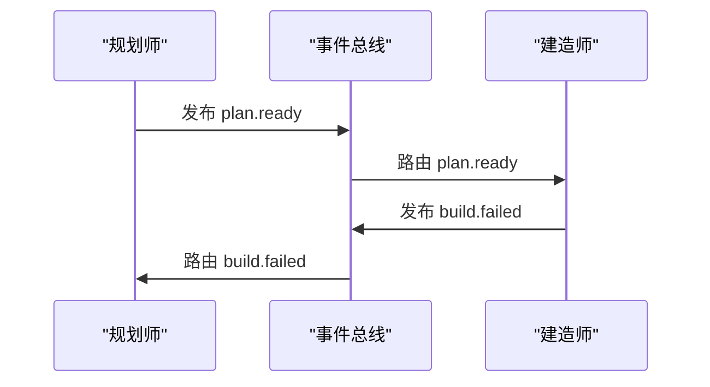

# 06 - 神经系统：事件与路由

> *如果说“循环”是心脏，“帽子”是器官，那么**事件**就是连接它们的神经系统。*

## 引言：疼痛的信号

当你的手指不小心碰到滚烫的炉灶时，手指不会写一份详细的报告，通过邮件发送给大脑，列出炉灶的温度、化学成分以及接触时长。

绝对不会。

它只会发送一个尖锐、即时的信号：**痛！**

大脑接收到这个信号，立刻向肌肉发出指令：**缩手！**

这就是 Ralph 系统中**事件（Events）**的工作原理。它们是系统中的突触——快速、轻量，专为触发行动而生。

## 是信号，不是货物

构建智能体系统时，一个常见的错误是试图把整个世界的状塞进消息传递系统中。这就像试图通过电报线传输一整座图书馆的书籍。

在 Ralph 中，我们遵循一条严格的生物学法则：**事件是路由信号，而非数据载体。**

### 事件的解剖学

Ralph 中的事件非常轻量。通常长这样：

*   **主题 (Topic)**：`task.completed`（信号类型）
*   **载荷 (Payload)**：`id: 123`（最小必要上下文）

这就够了。它不包含编写的代码、测试日志或完整的文件历史。那些沉重的“货物”生活在**记忆**（大脑）或**文件系统**（环境）中。事件只是在喊：“嘿！看这里！`task.completed` 发生了！”

## 突触：从帽子到帽子

在上一篇文章中，我们介绍了**帽子**（专家角色）。但一个独自坐在房间里的专家只是孤家寡人，不是一个组织。他们需要交流。

事件就是他们通用的语言。


### 序列图视角



### 声明式反射

系统如何知道谁该听什么？在生物学中，神经通路是随着时间建立的。在 Ralph 中，我们在 `ralph.yml` 中定义它们。这就是所谓的**声明式路由（Declarative Routing）**。

你明确地告诉每一顶帽子要监听什么信号（`triggers`），以及它可以发射什么信号（`publishes`）。

```yaml
# "神经系统"地图
hats:
  architect:
    # 大脑监听问题
    triggers:
      - "build.failed"
      - "task.blocked"

  builder:
    # 肌肉等待指令
    triggers:
      - "plan.ready"
    publishes:
      - "build.done"
      - "build.failed"
```

这种配置创造了一种可预测的“反射弧”。如果 `build.failed` 信号亮起，**架构师 (Architect)** 帽子会立即“醒来”分析错误。建造师不需要知道架构师是谁；它只是在大喊“我搞砸了”（`build.failed`），系统会确保合适的专家来处理。

## 为什么“轻量”很重要？

为什么我们要如此执着于微小的事件？

1.  **速度**：检查像 `review.done` 这样的字符串是瞬间的。解析一个 5MB 的 JSON 上下文对象则不是。
2.  **解耦**：如果规划师发送一个巨大的数据对象给建造师，建造师就会依赖于那个数据结构。如果数据格式变了，建造师就会崩溃。通过只发送信号（`plan.ready`），建造师知道去查看标准计划文件（“共享内存”）获取细节。
3.  **清晰**：你只需要阅读事件日志就能追踪智能体的逻辑。它读起来像个故事：`plan.ready` -> `code.written` -> `test.failed` -> `plan.revised`。

## 小结

事件是 Ralph 编排器中的生命火花。它们将一堆静态工具和提示词变成了一个动态、反应灵敏的有机体。

*   **事件即突触**：连接各个器官（帽子）。
*   **信号而非货物**：承载意图，而非沉重的数据。
*   **声明式连线**：`triggers` 和 `publishes` 绘制了神经通路。

有了身体（帽子）和神经系统（事件），我们需要东西来让血液流动。接下来，我们将看看**循环 (The Loop)**——驱动这一切的心跳。

---

*上一篇：[换顶帽子换个人：AI 的多重人格](05-hats-system.md)*

*下一篇：[核心跳动：AI 智能体的心跳循环](07-the-loop.md)*
