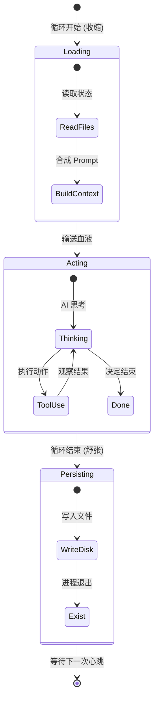

# 核心跳动：AI 智能体的心跳循环

> "循环意味着重生，不只是重复。"
> —— Ralph 架构哲学

## 引言：生命的节奏

把手放在左胸口，生命的律动清晰可感。

**扑通、扑通、扑通……**

这是生命最基础的节奏——心跳。每一次跳动，心脏都把富含氧气的新鲜血液泵向全身，特别是大脑；每一次舒张，又将含有废物的陈旧血液回收净化。

如果没有这个循环，大脑会在几分钟内缺氧死亡。

在 Ralph Orchestrator 的世界里，也有这样一个核心机制，它是整个智能体系统的生命之源。我们称之为——**The Loop（循环）**。

## 什么是"The Loop"？

在最简单的层面上，Ralph 就是一个不断运行的程序循环。如果你看过它的源代码，核心逻辑可能简单得令人发指：

```bash
while true; do
    # 1. 准备环境（吸气）
    # 2. 运行 AI 思考与行动（泵血）
    # 3. 保存状态并退出（呼气）
done
```

这看起来平平无奇，对吧？所有程序不都是在循环吗？

但 Ralph 的"循环"有一个本质的不同：**每一次循环，都是一次完整的"生死"轮回。**

### 离散的脉搏，有别于连续的水流

大多数传统软件像是一条河流。程序启动后，一直运行，变量一直在内存里，状态一直在累积。

与流淌的河流不同，Ralph 更像**脉搏**。

1.  **收缩（Systole）**：循环开始。系统读取所有文件，打包成"新鲜血液"（Context），注入 AI 的"大脑"。AI 思考，执行任务，修改文件。
2.  **舒张（Diastole）**：循环结束。AI 进程完全终止。所有的短期记忆（RAM 中的变量）全部释放。只有写在磁盘上的东西被保留下来。

然后，下一次心跳开始。

## 为什么要这样设计？

### 1. 输送"新鲜血液"

我们在[《每次都是新开始》](02-fresh-context.md)中提到过"新鲜上下文"的重要性。

如果你的心脏不泵血，让同一管血液一直停留在血管里，血液里的氧气会耗尽，毒素会堆积。

同样的，如果 AI 长期运行而不重置上下文，它的"思维血液"就会变得陈旧：
- **氧气耗尽**：上下文窗口被无关信息填满。
- **毒素堆积**：错误的假设、幻觉、无效的尝试路径会污染它的判断。

Ralph 的循环机制，就像心脏一样，**强制性地**在每次迭代时泵入全新的、富含氧气的血液（从磁盘重新读取的、准确的项目状态）。

### 2. 防止"脑缺氧"

当 AI 在处理复杂任务时，很容易陷入"思维死胡同"。

这就好比一个人盯着一道难题看了太久，大脑缺氧，越看越糊涂。

Ralph 的循环机制强制 AI "深呼吸"。每次循环结束，就像是说："好了，停下来，把现在的进度写在纸上，然后忘掉刚才的纠结。深呼吸，我们重新开始。"

这种**节奏感的重置**，保证了 AI 始终处于清醒、敏锐的状态。

## 循环的解剖学

让我们用显微镜看看这颗心脏的一次完整跳动（一个 Iteration）里发生了什么：

### 第一阶段：充盈（Loading）
- **读取状态**：系统扫描 `.agent/tasks.jsonl`（待办事项）和 `.ralph/agent/scratchpad.md`（思考笔记）。
- **感知环境**：系统查看当前的代码库状态、测试结果、最近的错误日志。
- **合成血液**：将这些信息打包成 Prompt（提示词）。

### 第二阶段：泵血（Acting）
- **激活大脑**：Prompt 被发送给 LLM（大语言模型）。
- **思维涌现**：AI 分析现状，决定下一步做什么。
- **执行动作**：AI 调用工具（Tools）——修改代码、运行命令、写入文件。

### 第三阶段：静息（Persisting）
- **记忆固化**：行动结果必须写入磁盘。仅存在于思维中的想法，会在循环结束时消散。
- **清理现场**：进程退出，内存清空。



## 心脏（循环）与身体（磁盘）

你可能会问：如果每次心跳结束 AI 都"死"了一次，它怎么记得之前做过什么？

这就回到了我们的人体隐喻：

- **大脑（AI）**：负责思考，但每秒钟都在更新，不存储长期记忆。
- **身体（磁盘/文件系统）**：负责记忆。

你的心脏不需要"记得"上一次跳动是什么时候，它只需要按照身体的需求继续跳动。身体的每一个细胞（文件）都记录了岁月的痕迹（代码变更）。

当 Ralph 的循环再次启动时，AI 醒来，看到磁盘上的文件（身体的状态），它就知道："哦，我上次做到了这一步。接下来我该做那个。"

## 只要心在跳，生命就在继续

Ralph 的这种架构赋予了它极强的生命力。

- **崩溃了？** 没关系，只是错过了一次心跳。下一次循环启动时，会读取错误日志，纠正问题，继续前进。
- **断电了？** 没关系，状态都在磁盘上。电力恢复，心跳恢复，一切如常。

这不仅是一个技术架构，更像是一种生物学奇迹。它容忍失败，自我修复，生生不息。

## 小结

Ralph 的 **The Loop（循环）** 不仅仅是一个 `while` 语句，它是：

1.  **生命的节奏**：给 AI 提供离散的、有节奏的工作单元。
2.  **血液的泵送**：强制刷新上下文，防止思维"缺氧"。
3.  **生死的轮回**：每次迭代都是新的开始，依靠磁盘文件传承记忆。

有了这颗强有力的心脏，Ralph 才能在复杂的编程任务中，保持清醒，保持活力，一步步走向目标。

---

*上一篇：[神经系统：事件与路由](06-events-routing.md)*

*下一篇：[大脑的笔记本：内存与状态管理](08-memory-and-state.md)*
