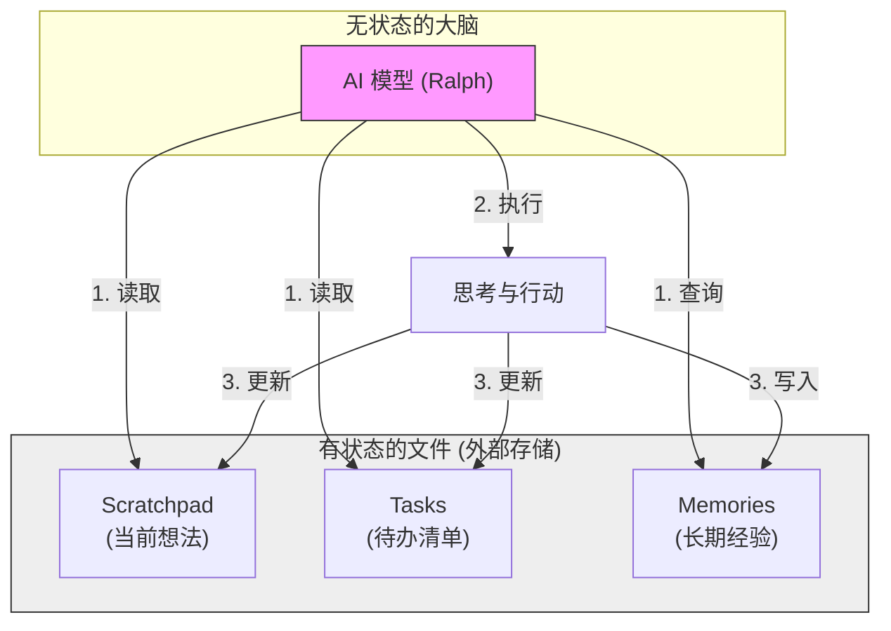

# 大脑的笔记本：内存与状态管理

> **核心隐喻**：失忆的天才 (Memento / 记忆碎片)
>
> 如果爱因斯坦患上了严重的顺行性遗忘症，每过十分钟，他的记忆就会被彻底重置。他依然拥有顶级的智商和推理能力，但却不记得自己上一刻在推导什么公式，也不记得自己是谁。
>
> 这样的人能完成长达数年的相对论研究吗？
>
> 答案是：能。只要他拥有一套完美的笔记系统。

在上一章《无限循环》中，我们介绍了 Ralph 的核心工作模式——**循环（The Loop）**。每一次循环，大模型都会被“唤醒”，处理输入，然后“休眠”。

这里有一个残酷的技术现实：**大模型是无状态的（Stateless）**。

当 Ralph 在第 N 次循环醒来时，他完全不记得第 N-1 次循环发生了什么。不仅如此，他连自己是谁、要做什么项目、昨天写了什么代码都忘得一干二净。每一次唤醒，对他来说都是生命的“第一次”。

然而，Ralph 却能表现得像一个连续工作的资深工程师：他记得任务进度，记得代码规范，甚至记得不要犯同样的错误。

他是如何做到的？这就要归功于他的“外挂大脑”——**外部状态文件**。如同电影《记忆碎片》的主角，通过纹身、照片和纸条来维持行动的连续性，Ralph 依靠三个关键的“笔记本”来对抗遗忘。

## 1. 草稿纸 (Scratchpad)：此时此刻的思考流

> **隐喻**：办公桌上的一张凌乱的草稿纸，上面写满了推导公式和“下一步做什么”的速记。

**Scratchpad** 是 Ralph 最即时的短期记忆。

在每次循环开始时，Ralph 会首先阅读这张“草稿纸”。这里记录了他上一次循环结束时的思维快照：
*   “我现在正在修复登录模块的 Bug。”
*   “刚才测试失败了，原因是端口被占用。”
*   “我打算用 `lsof` 命令查一下端口。”

如果没有这张纸，Ralph 醒来看到报错信息，可能会一脸茫然：“这是哪来的报错？我为什么要跑这个测试？”

Scratchpad 保证了**思维的连贯性**。它让 Ralph 在被打断（循环结束）后，能够无缝地接上之前的思路，仿佛从未停止过思考。

## 2. 任务清单 (Tasks)：宏观进度的罗盘

> **隐喻**：贴在显示器边上的 To-Do List，清晰地划掉了已完成项，圈出了当前项。

如果说 Scratchpad 是微观的“刚才想到了哪”，那么 **Tasks** 就是宏观的“项目到了哪个阶段”。

一个复杂的软件开发任务可能需要几百个步骤。对于“失忆”的 Ralph 来说，知道“我在哪”至关重要。Tasks 系统是一个结构化的 JSONL 文件，严格记录了：
*   ✅ **已完成**：环境搭建、数据库迁移
*   🔄 **进行中**：编写用户验证接口 (User Auth API)
*   ⏳ **待办**：前端页面对接、集成测试

每当 Ralph 完成一个小步骤，他就会在任务清单上打钩。下一次醒来，他只需要看一眼清单：“哦，Auth API 还在进行中，那我继续写代码。”

这防止了他在无限的循环中迷失方向，或者重复做已经做过的事情。

## 3. 长期记忆 (Memories)：经验与教训的沉淀

> **隐喻**：一本厚厚的《工程操作手册》或《错题集》，上面贴满了便利贴：“注意！这个服务器不能用 SQLite”，“部署前记得清理缓存”。

最让 Ralph 像一个“资深”工程师的，是他的 **Memories** 系统。

在开发过程中，Ralph 会遇到各种坑：
*   “这个库在 Windows 下有兼容性问题。”
*   “团队的代码规范要求变量必须用蛇形命名法 (snake_case)。”
*   “上次用这个 API 时，必须加一个特殊的 Header 才能通。”

普通大模型或许会在同一个坑里跌倒十次，但 Ralph 会将教训写入 Memories 文件。

在开始新任务前，Ralph 会通过语义搜索（Semantic Search）查询这个知识库。当他再次遇到类似场景时，哪怕那是十天前（也就是几百次循环前）学到的教训，现在的他也能瞬间回想起来：“啊，我有印象，这里要小心。”

## 总结：构建连续的智能

Ralph 本质上是一个**无状态的天才**，但他生活在一个由**有状态的文件**构建的房间里。

*   **Scratchpad** 让他知道**此时此刻**在想什么。
*   **Tasks** 让他知道**今天**要达成什么目标。
*   **Memories** 让他拥有**过去**积累的智慧。

通过这三个“外部笔记本”，我们将一个个离散的、瞬间的智能片段，通过文件读写串联起来，在时间轴上编织出了一个看似拥有连续人格和深厚经验的超级工程师。

这就是 Ralph 战胜遗忘、驾驭复杂的秘密。

---

*上一篇：[神经系统：事件与路由](07-the-loop.md)*

*下一篇：[侦探的笔记本：Scratchpad (草稿纸)](09-the-scratchpad.md)*
