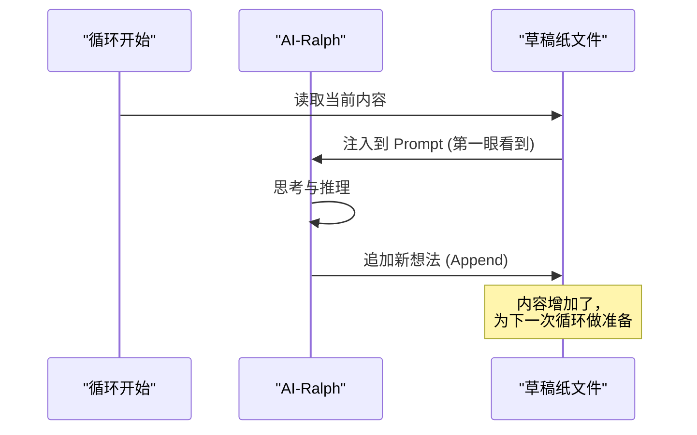

# 侦探的笔记本：Scratchpad (草稿纸)

> **核心隐喻**：福尔摩斯的随身笔记本 / 科学家的实验日志
>
> 想象一位神探正在调查一桩复杂的悬案。他在现场发现了一个脚印，脑海中闪过三个推论，并决定下一步去查验鞋店的记录。
>
> 就在这时，有人在他后脑勺重重一击。当他醒来时，他失忆了。
>
> 如果他口袋里有一张清单写着“去鞋店”，他会照做，但他不知道**为什么**要去，也不知道他在找什么特殊的鞋底花纹。
>
> 但如果他有一本写满推论、猜想和观察记录的笔记本，他阅读之后，那个敏锐的侦探瞬间就“回来”了。

在 Ralph 的世界里，遗忘是宿命。为了对抗这种宿命，我们引入了上一章提到的三个工具。其中，**Scratchpad (草稿纸)** 是最特殊、最核心的一个——它是 Ralph 的**意识流（Stream of Consciousness）**。

## 为什么“任务清单”还不够？

你可能会问：“既然有了 Tasks（任务清单）告诉 Ralph 下一步做什么，为什么还需要 Scratchpad？”

让我们看一个例子。

**只有任务清单 (Tasks) 的情况：**

* [ ] 修复登录超时 Bug
* [X] 检查数据库连接

当 Ralph 醒来看到这个清单，他知道要修 Bug。但是：

* “我之前怀疑是什么原因导致的超时？”
* “我刚才检查数据库连接时，看到了什么异常吗？”
* “我已经排除了网络问题吗？”

这些**上下文（Context）**丢失了。任务清单只记录了“做什么 (What)”，却丢失了“为什么 (Why)”和“怎么做 (How)”。没有 Scratchpad，Ralph 就像一个只会执行指令的机器人，而不是一个会思考的工程师。

## 捕捉“思维的火花”

Scratchpad 的设计初衷，就是为了捕捉那些稍纵即逝的思维过程。它不仅仅是记录，更是**思考的延伸**。

在 Ralph 的架构中，Scratchpad 是一个 Markdown 文件，通常包含以下内容：

1. **当前焦点 (Current Focus)**：我现在具体在盯着哪一行代码看？
2. **推理过程 (Reasoning)**：为什么这段代码会报错？我的假设是什么？
3. **观察记录 (Observations)**：运行 `ls -l` 后看到了什么？测试输出了什么错误码？
4. **微观计划 (Micro-Plan)**：接下来的 5 分钟，我打算先试 A 方案，如果不行再试 B 方案。

### 一个真实的 Scratchpad 片段

这看起来就像是程序员的自言自语，或者科学家的实验日志：

```markdown
<scratchpad>
# 现状分析
测试 `test_login` 失败了，报错是 "500 Internal Server Error"。

# 推理
刚才我检查了 Nginx 日志，没有请求记录。这说明请求根本没到 Nginx，或者在到达前就挂了。
既然本地开发环境是 Docker 部署的，我怀疑是容器端口映射有问题，或者是防火墙拦截了。

# 验证计划
1. 先用 `docker ps` 看看容器活没活着。
2. 如果活着，进容器内部 `curl` 一下 localhost 看看服务本身通不通。
3. 如果容器内通但外面不通，那就是端口映射配置错了。

# 下一步行动
执行 `docker ps`。
</scratchpad>
```

当下一个循环的 Ralph 读取这段文字时，他不仅知道要“执行 `docker ps`”，他还完全理解了**背后的逻辑链条**。他继承了上一个自我的智慧。

## 它是如何工作的？

Scratchpad 的机制非常简单，遵循**“读取-追加” (Read-Append)** 模式：

1. **唤醒时读取**：每次 Ralph 启动（Start of Loop），系统会将 `scratchpad.md` 的内容自动注入到他的提示词（Prompt）最显眼的位置。这是他醒来后看到的“第一眼”。
2. **思考时追加**：在 Ralph 工作的过程中，他会不断地往这个文件末尾追加新的想法。
   * “执行了命令，输出是 X。”
   * “看来我的假设错了，原因不是端口问题。”
   * “发现了新线索 Y。”



## 保持“上下文窗口”的清洁

大模型有一个致命限制：**上下文窗口（Context Window）是有限的**。我们不能把项目开始以来的所有对话历史都塞给他，那太贵且太慢了。

Scratchpad 起到了**“有损压缩”**的作用。

在每一轮循环结束时，我们不需要保留所有的系统日志和繁琐的对话，只要保留 Scratchpad 中提炼出的**思维精华**。这样，Ralph 就能以极小的上下文代价，维持极长的逻辑连贯性。

## 总结

如果说 Tasks 是 Ralph 的**手脚**，指引行动的方向；
Memories 是 Ralph 的**长期记忆**，积累过去的经验；
那么 Scratchpad 就是 Ralph 的**前额叶皮层**，承载着当下的认知与推理。

正是这本“侦探的笔记本”，让 Ralph 能够跨越生灭的循环，保持连贯的灵魂，去解决那些需要深度思考的复杂问题。

---

*上一篇：[大脑的笔记本：内存与状态管理](08-memory-and-state.md)*

*下一篇：[技能系统：&#34;我会功夫了&#34;)](10-skills.md)*
