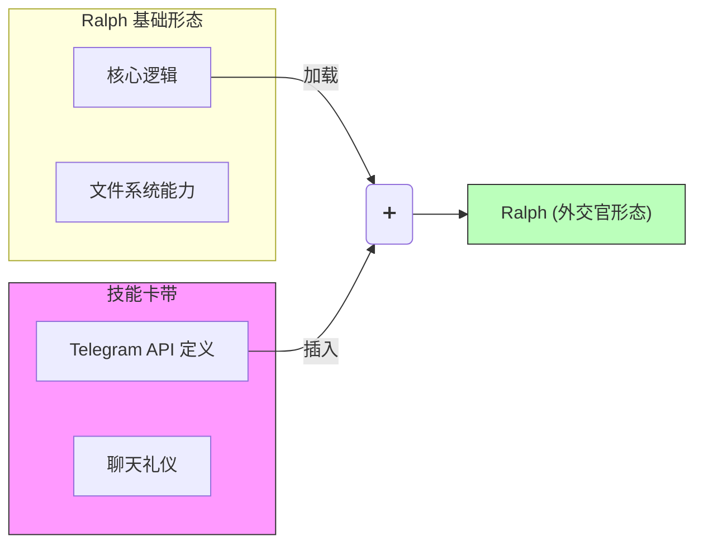

# 10 - 技能系统："我会功夫了"

> "柔术？我要学柔术？"
> ...
> "我会功夫了。"
> — 尼奥，《黑客帝国》 (1999)

在经典科幻电影《黑客帝国》中，角色们不需要在道场里苦练数年。当需要战斗时，操作员只需将格斗程序直接“上传”到他们的大脑。几秒钟内，他们就从新手变成了大师。

Ralph 使用了一种惊人相似的机制来管理他的能力，我们称之为**技能系统 (Skills)**。

## 上下文经济学

要理解为什么需要技能，我们必须谈谈“上下文窗口”。

不妨将 Ralph 的大脑（大语言模型）看作一个工作台。每一条指令、每一个文件、每一条规则和每一个工具定义，都要占据工作台的空间。

如果我们试图一次性教给 Ralph **所有**东西——如何管理数据库、如何写 Python、如何发推特、如何编辑 PDF、如何调试 Kubernetes——他的工作台就会乱成一团，根本腾不出地方干活。他会不知所措，反应迟钝，甚至“忘记”压在文件堆底下的指令。

大多数 AI 智能体通过成为“专家”（硬编码只做一件事）或“万金油”（什么都懂一点但都不精）来解决这个问题。Ralph 选择了第三条路：**即时能力 (Just-in-Time Competence)**。

## 卡带系统

Ralph 每天轻装上阵。他的“基础系统”只包含最核心的内容：如何思考、如何使用文件系统、以及如何在循环中导航。

但假设他遇到了一项任务，需要通过 Telegram 与人类互动。默认情况下，他并未加载这些指令。

Ralph 不会两手一摊放弃，而是请求获取这项能力：

```bash
ralph tools skill load robot-interaction
```

编排器充当了“操作员”（《黑客帝国》里的 Tank）。它检索 Telegram 互动的特定“指令卡带”——API 定义、格式规则、通信协议——并将其“上传”到 Ralph 当前的上下文中。

瞬间，他就知道怎么和机器人对话了。



## 模块化精通

这种模块化方法带来了深远的好处：

1.  **专注**：当 Ralph 写代码时，他加载 `coding` 技能。他不会被如何撰写营销文案的指令分心。
2.  **效率**：我们要像吝啬鬼一样节省 Token（计算货币），只加载当前任务绝对必要的内容。
3.  **可扩展性**：添加新能力不需要重新训练 Ralph。我们只需编写一个新的“技能定义”（一个包含指令的 Markdown 文件）并将其添加到库中。

## 常用技能

就像尼奥可以在“功夫”和“直升机驾驶”程序之间切换一样，Ralph 也在常用技能之间切换：

*   **`ralph-tools`**：用于管理项目长期记忆和任务追踪的重型机械。
*   **`robot-interaction`**：当他卡住时，用于向人类求助的协议。
*   **`git-wizard`**：用于处理复杂合并的高级版本控制工作流。

## 动态智能体

这让 Ralph 从一个静态工具变成了**动态智能体**。他能调整自己的内部软件来适应手头的问题。

如果遇到锁，他就变成锁匠。如果遇到断路，他就变成电工。当工作完成后，他卸载技能，清空工作台，为下一个挑战做好准备。

他可能（还）不能在物理世界躲避子弹，但在软件工程的领域里，这种根据需要重塑自身能力的本领，让他同样身手矫健。

---

*上一篇：[侦探的笔记本：Scratchpad (草稿纸)](09-the-scratchpad.md)*

*下一篇：[任务双轨制：战略与战术](11-tasks-two-systems.md)*
