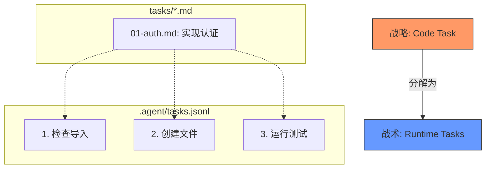

# 任务双轨制：战略与战术

> "战略如果没有战术，是通往胜利最慢的路径。战术如果没有战略，只是失败前的喧嚣。"
> —— 孙子

将军在指挥帐指着地图下令：“拿下那座山头。”这就是**战略（Strategy）**。这是一个宏大的目标，可能耗时数日，涉及成千上万个具体行动。

而在战场上的军士长，不会仅是高喊“拿下山头！”他会指挥：“提供掩护火力！”“A 队，左翼包抄！”“换弹夹！”“清理那个碉堡！”这就是**战术（Tactics）**。这些是为了实现战略目标，在激烈的战斗中采取的即时、具体的行动。

作为自主智能体，Ralph 二者缺一不可。他需要明确*要建造什么*（战略），以及*如何*执行当下的步骤（战术）。为了处理这两种需求，Ralph 采用了两套独特的任务系统。

## 战略：代码任务 (Code Tasks)

**代码任务**相当于将军的命令。它们是由你——用户——设定的软件工程目标。

* **例子**：“实现用户认证”、“重构支付网关”、“修复解析器中的内存泄漏”。
* **持久性**：这些任务是长期的。它们以 Markdown 文件的形式存在于 `tasks/` 目录中（例如 `tasks/01-auth.code-task.md`）。在功能完全实现并合并之前，它们会在多次会话中持续存在。
* **受众**：人类和智能体。你阅读它们以了解项目状态；Ralph 阅读它们以明确工作目标。

## 战术：运行时任务 (Runtime Tasks)

**运行时任务**相当于军士长的检查清单。它们是 Ralph 为自己创建的短暂、细粒度的步骤，用来在循环中追踪当前的工作进度。

* **例子**：“读取 `src/auth.ts` 检查导入”、“运行 `grep` 查找 `login()` 的用法”、“创建文件 `src/login_handler.ts`”、“为认证模块运行测试”。
* **持久性**：这些是短期的。它们存在于一个隐藏文件（`.agent/tasks.jsonl`）中，通常在几次循环迭代内就会被创建、完成并清除。
* **受众**：仅限 Ralph。你通常不需要关心 Ralph 在写代码之前是否需要“grep 查找导入”，你只关注代码产出。

## 为什么要分开？

为何不共用一份清单？因为**细节会干扰大局**。

如果你的项目路线图（战略）充斥着成千上万条像“修复注释拼写错误”或“重新运行失败的测试”这样的条目，你就无法看清全局。反之，如果 Ralph 只有高层次的指令“构建认证”，他就缺乏在复杂的代码库中导航时保持专注所需的细致检查清单。

通过将**代码任务**（我们要构建什么）与**运行时任务**（构建它的步骤）分开，Ralph 既为你保持了一个干净的项目看板，同时也为自己保留了一份严格、详细的检查清单。

* **代码任务** = 目的地。
* **运行时任务** = 到达那里的步骤。

---

*上一篇：[技能系统：&#34;我会功夫了&#34;)](10-skills.md)*
